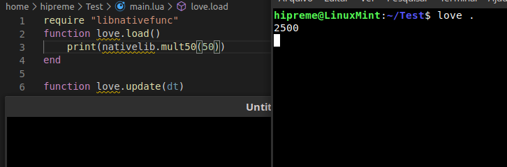

# How-to-add-your-C-Library-in-Lua
Basic example of how to integrate your C Library with Lua

Hello guys, I've been in some trouble getting to have a C Library working with love, so I want to archive how to do it:
This tutorial is made mainly for  **Linux **, but experienced users from windows will understand what to do

First things first, if you're working on a linux environment, you will want to install Lua (which you're probably using only from love), but it should not be any version, it must be the same Lua version used with  **Love 11.3 **, which is  **Lua 5.1 **, so execute the following command in your terminal
```sh
sudo apt-get install lua5.1-dev 
```
Using this version is important, as I was reading, I felt that Lua changed how you exported C functions in every version

That command will install in your  **/usr/include/lua5.1** Lua headers for working with C.

Now, for compiling C you must install the gcc command, doing so is as simply as calling in the terminal ```shsudo apt-get install gcc ```
After that, you will need to create your C file with the function to export, so let's call it  **nativefunc.c**

After creating your file, you will need to import 2 main libraries in your C code, the lua lib, and the lua auxiliary lib:
```c
#include <lua.h>
#include <lauxlib.h>
 ```

 **[Optional reading for this tutorial](You will need that for writing more complex functions)**
After that, you will want to study some specifications on chapters: 26 to 28 from the lua.org site: https://www.lua.org/pil/contents.html
### Chapters to read
- 26=> Calling C from Lua
- 27=> Techniques for Writing C Functions
- 28=> User-Defined types in C

After that read you will have the most you need for writing complex C functions, following, let's create your first C export function:
Every exported function must follow the following prototype: ```ctypedef int (*lua_CFunction) (lua_State *L) ```

That means: define a function whose return type is  **int **, and the parameters received are  **lua_State* L **, so, take a look on how it is defined:

```c
static int l_mult50(lua_State* L) 
```
As you can see, there are some common practives there: the first thing is that usually the functions are declared as static functions, in C, that means your function won't be visible outside, l_ is commonly used for showing that is the function that is on the lib.

For getting parameters in your function you must get it's index, every parameter function starts from 1, so an example would be:
```c
double number = lua_tonumber(L, 1); 
```
That function will receive the number passed when you're calling it from your Lua script in the first parameter, but that is type unsafe, if you want to get the famous error message if you pass the wrong message, you need to switch it for:
```c
double number = luaL_checknumber(L, 1) 
```
Some of these checks are as easily to remember as
## Checktype Functions
- luaL_checkstring,
- luaL_checknumber,
- luaL_checkint,
- luaL_checkany

Now you're ready to do whatever you want with the parameters, as shown in the simple example, let's multiply it for 50
```c
number*= 50;
```
(Short for number = number * 50)
After that, we will want to return it into some variable in Lua, so how we do that?
You need to call lua_push[data](value), the most common to find using are:
### Push Value functions
- lua_pushnumber,
- lua_pushboolean,
- lua_pushstring,
- lua_pushcfunction,
- lua_pushnil,
- lua_pushvalue**

In our case, we're returning a number, so:
```c
lua_pushnumber(L, number); 
```
After that, we need to return from our function, but there is one important thing:
 **Our function must return how many values we pushed**
So, in our case we must ```creturn 1 ```
In cases where you return for instance x and y, you would return 2, (as you would need to pushnumber x and pushnumber y)

So, our finished function looks like this:
```c
static int l_mult50(lua_State* L)
{
    double number = luaL_checknumber(L, 1);
    lua_pushnumber(L, number*50);
    return 1;
}
 ```
After that, Lua will need to name the function and where to find it, this part is extremely important for executing it in Lua.
You will need to create another function with the prefix luaopen_
After that prefix, you need to put the filename that will be imported in your game, in our case, as it will be called libnativefunc.so (dll in Windows case), the final name will be luaopen_libnativefunc
I'm using lib as the file prefix because it is a good practice starting your lib names with [i]lib[/i]
So let's start defining the function
```c
int luaopen_libnativefunc(lua_State* L) 
```
Now we need to define what functions our lib will implement in Lua, for doing that we need to define a C Struct Array, it is defined as:
```c
static const struct luaL_Reg nativeFuncLib [] 
```
luaL_Reg is a struct defined by Lua that has a name and has a function, so it's important to keep using this type, for defining it, we will use the array populate operator:
```c
static const struct luaL_Reg nativeFuncLib [] =
{
    {"mult50", l_mult50}, //Your function name, and the function reference after
    {NULL, NULL}
}
```
As you can see, the registered functions from our lib must  **ALWAYS** end with {NULL, NULL}, it means that it has finished iterating throughout our array, failing to do so will give the following error
 **Segmentation Fault (core dumped)**
This is a default C error message when your iterator goes out from the array length
After that, in the same function, you will need to register your lib in Lua, this is where I got the most errors trying to find the correct one to use:
```c
luaL_register(L, "nativelib", nativeFuncLib)
```
nativelib is the global variable which will hold your library functions, and it is defined as one kind of Lua callback table:
nativelib["mult50"](), that's how it will work, for finishing it, just return 1, and now I will put all the code here for easier following:


```c
#include <lua.h>
#include <lauxlib.h>

static int l_mult50(lua_State* L)
{
    double number = luaL_checknumber(L, 1);
    lua_pushnumber(L, number*50);
    return 1;
}

int luaopen_libnativefunc(lua_State* L)
{
    static const struct luaL_Reg nativeFuncLib [] =
    {
         {"mult50", l_mult50}, //Your function name, and the function reference after
         {NULL, NULL}
    };
    luaL_register(L, "nativelib", nativeFuncLib);
    return 1;
}
```

That's our finished  **nativefunc.c** file
After that, for using it on our Lua code, we will need to compile it as a Shared object, most know as library,  .so or .dll files
For doing that, we will need to compile it with our new gcc command
```sh
gcc -I/usr/include/lua5.1 nativefunc.c -c -fPIC 
```
This code will compile our code without linking it, it will output one file named "nativefunc.o", and now we will work with it:
```sh
gcc nativefunc.o -shared -o libnativefunc.so 
```
(Transform that .so in .dll in windows)
After that, you will finally generate the file that you will import in Lua, for doing it there are 2 commons way, one being easier and less flexible, the other, the anthonym:

 **Easy way**
```lua
require "libnativefunc" 
```

 **Harder way**
```lua
lib = package.loadlib("./libnativefunc.so", "luaopen_libnativefunc")
lib();
--Shorter Version - package.loadlib("./libnativefunc.so", "luaopen_libnativefunc")()
```
So, basically, the difference between the harder and easier way, is that in the harder way, you define which function registers your library
After that, you will be able to call your own 
```lua
print(nativelib.mult50(50))
```


